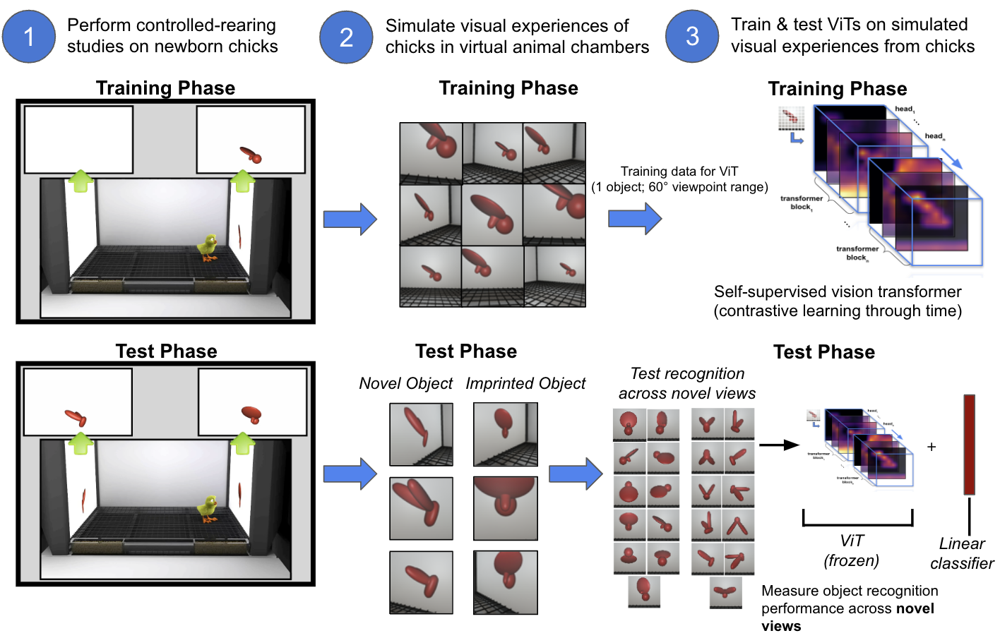

<h1 align="center">Are Vision Transformers More Data Hungry Than Newborn Visual Systems?</h1>
<center> Lalit Pandey, Samantha M. W. Wood, Justin N. Wood </center>

### Accepted Conference: NeurIPS 2023





## Abstract
Vision transformers (ViTs) are top-performing models on many computer vision benchmarks and can accurately predict human behavior on object recognition tasks. However, researchers question the value of using ViTs as models of biological learning because ViTs are thought to be more “data hungry” than brains, with ViTs requiring more training data to reach similar levels of performance. To test this assumption, we directly compared the learning abilities of ViTs and animals, by performing parallel controlled-rearing experiments on ViTs and newborn chicks. We first raised chicks in impoverished visual environments containing a single object, then simulated the training data available in those environments by building virtual animal chambers in a video game engine. We recorded the first-person images acquired by agents moving through the virtual chambers and used those images to train self-supervised ViTs that leverage time as a teaching signal, akin to biological visual systems. When ViTs were trained “through the eyes” of newborn chicks, the ViTs solved the same view-invariant object recognition tasks as the chicks. Thus, ViTs were not more data hungry than newborn visual systems: both learned view-invariant object representations in impoverished visual environments. The flexible and generic attention-based learning mechanism in ViTs—combined with the embodied data streams available to newborn animals—appears sufficient to drive the development of animal-like object recognition.

## Code Base Organization
```
ViT-CoT
└── datamodules: directory containing python code to set up the datasets and dataloaders to train and test the model.
│   ├── compute_embeddings_videomae.py
│   ├── compute_embeddings_jepa.py
│   ├── compute_embeddings_simclr.py   
│
└── models: directory containing python code to set up the architecture for training and evaluating the model.
│   ├── compute_embeddings_videomae.py
│   ├── compute_embeddings_jepa.py
│   ├── compute_embeddings_simclr.py   
│
└── notebooks: Jupyter notebook files used for creating the graphs and attention head visualizations (as shown in the paper).
│   └── plotGraphs.ipynb
│   └── visualizeAttentionHeads.ipynb
│    
├── media: directory containing images and videos for the readme
```

## Environment Set Up
The proposed model in this paper is primarily implemented using <a href='https://lightning.ai/docs/pytorch/stable/'> PyTorch Lightning</a> and <a href="https://pytorch.org/"> Pytorch</a>. All the dependencies are listed in the <i><u>requirements.txt</u></i> file.

```python
pip install -r requirements.txt
```

## Model Training


## Model Testing


## Model Visualization


## Plot Results

<ol>
<li> <u><b>plotGraphs.ipynb</b></u> - Jupyter notebook containing python code to create bar graphs and line graphs (as shown in the paper). </li>
<br>
<li> <u><b>visualizeAttentionHeads.ipynb</b></u> - Jupyter notebook containing python code to show the internal representations (saliency maps) for each attention head (as shown in the paper). </li>
</ol>


## Contributors
<table>
  <tr>
    <td align="center"><a href="https://github.com/L-Pandey"><br /><b>Lalit Pandey</b></td>
    <td align="center"><a href="https://github.com/smwwood"><br /><b> Samantha M. W. Wood</b></td>
    <td align="center"><a href="https://github.com/justinnwood"><br /><b> Justin N. Wood</b></td>
  </tr>

</table>

  </tr>
</table>

## Citation 

```
@inproceedings{
pandey2023are,
title={Are Vision Transformers More Data Hungry Than Newborn Visual Systems?},
author={Lalit Pandey and Samantha Marie Waters Wood and Justin Newell Wood},
booktitle={Thirty-seventh Conference on Neural Information Processing Systems},
year={2023},
url={https://openreview.net/forum?id=W23ZTdsabj}
}
```

#### Notes:

